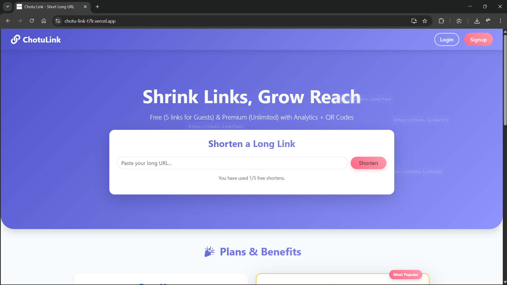
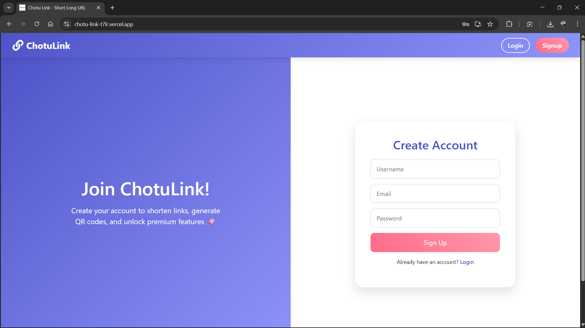
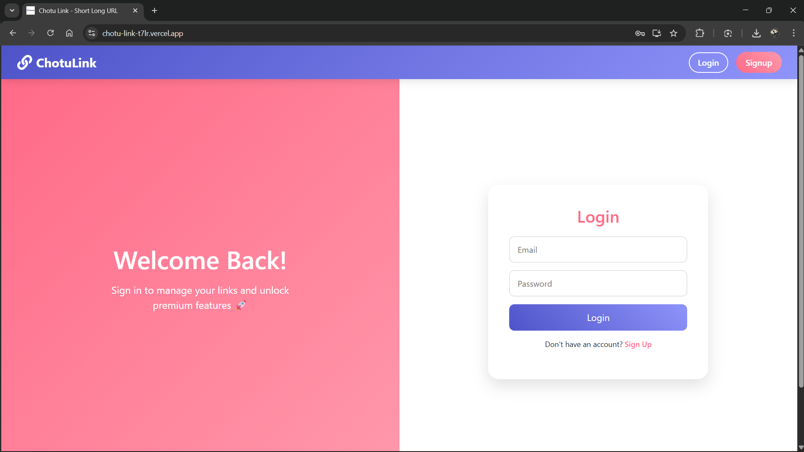
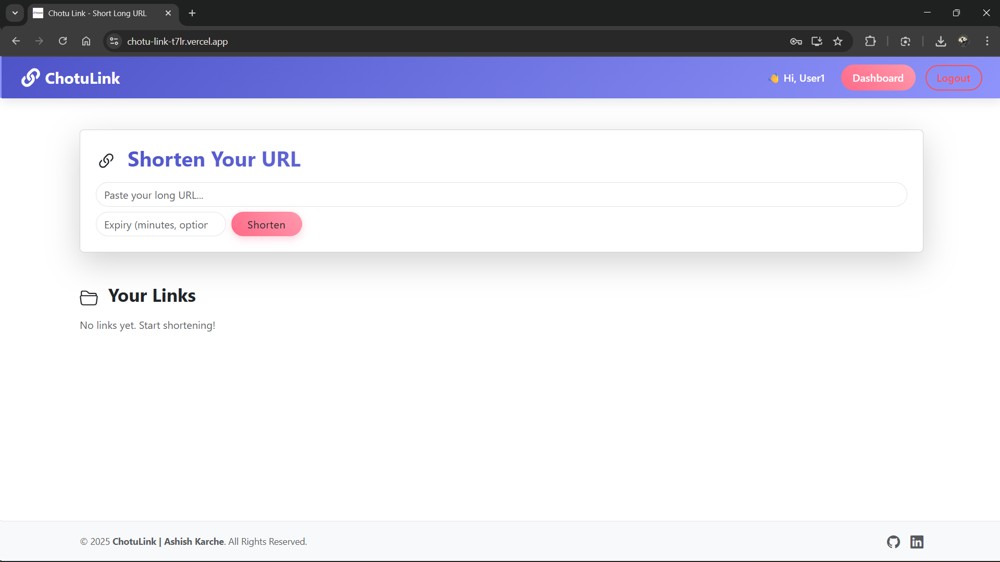
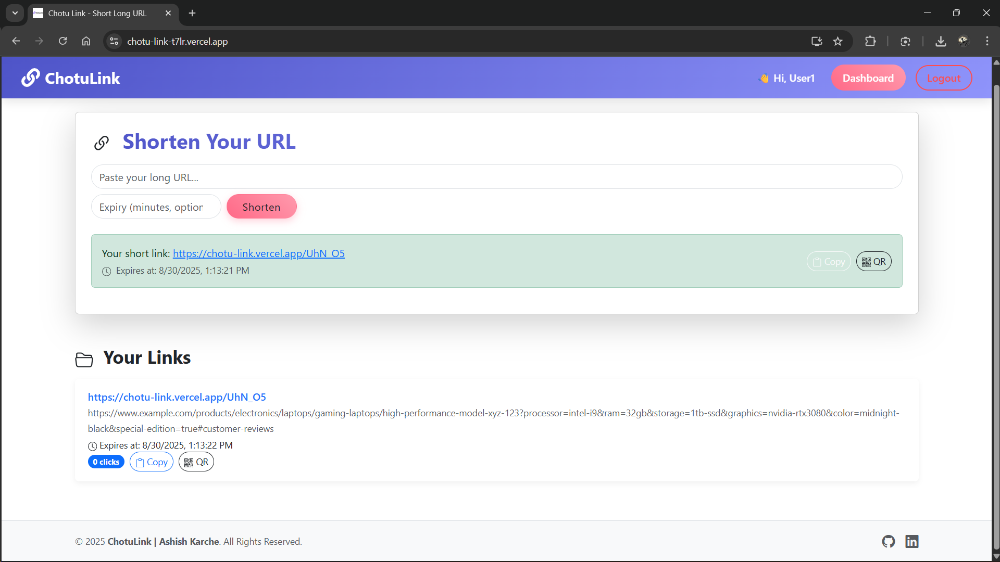

# ChotuLink 🚀

ChotuLink is a modern URL shortening web application designed to make link management effortless. It allows users to create short links, track clicks, generate QR codes, and access premium features. Guest users can try the service with limited functionality, while registered users enjoy full features.

---

## Table of Contents

- [Features](#features)
- [Tech Stack](#tech-stack)
- [Installation](#installation)
- [Database Setup](#database-setup)
- [Running the App](#running-the-app)
- [API Endpoints](#api-endpoints)
- [Frontend Pages](#frontend-pages)
- [Screenshots](#screenshots)
- [License](#license)
- [Author](#author)

---

## Features

### Guest Users
- Shorten URLs temporarily (not stored in the database)
- Limited to 5 requests per minute

### Registered Users
- Signup/Login with JWT authentication
- Create unlimited short links
- Set custom expiry dates for links
- Track clicks for each link
- Access dashboard to manage links
- Generate QR codes for links

### Security & Performance
- Rate limiting for signup, login, and guest actions
- JWT-based authentication for secure routes
- Helmet for enhanced HTTP headers security
- CORS enabled
- Logging with Morgan

---

## Tech Stack

- **Frontend:** React, Axios, React Icons  
- **Backend:** Node.js, Express.js  
- **Database:** MySQL / PostgreSQL  
- **Authentication:** JWT  
- **Security:** Helmet, Rate Limiter  
- **Other Libraries:** bcryptjs, nanoid, morgan  

---

## Installation

### 1. Clone the repository

```bash
git clone https://github.com/ashishkarche/chotu-link.git
cd chotu-link
```

### 2. Install backend dependencies

```bash
cd chotu-link-backend
npm install
```

### 3. Install frontend dependencies

```bash
cd chotu-link-frontend
npm install
```

### 4. Configure environment variables

Create a `.env` file in the `backend` folder:

```env
PORT=5000
JWT_SECRET=your-strong-random-key
DB_HOST=localhost
DB_USER=root
DB_PASSWORD=yourpassword
DB_NAME=chotu_link
```

---

## Database Setup

Run the following SQL commands:

```sql
CREATE DATABASE chotu_link;

USE chotu_link;

CREATE TABLE users (
  id INT AUTO_INCREMENT PRIMARY KEY,
  username VARCHAR(50) UNIQUE NOT NULL,
  email VARCHAR(100) UNIQUE NOT NULL,
  password_hash VARCHAR(255) NOT NULL,
  created_at TIMESTAMP DEFAULT CURRENT_TIMESTAMP
);

CREATE TABLE links (
  id INT AUTO_INCREMENT PRIMARY KEY,
  short_code VARCHAR(10) UNIQUE NOT NULL,
  short_url VARCHAR(255),
  original_url TEXT NOT NULL,
  user_id INT NULL,
  created_at TIMESTAMP DEFAULT CURRENT_TIMESTAMP,
  click_count INT DEFAULT 0,
  expires_at DATETIME NULL
);
```

---

## Running the App

### Backend

```bash
cd backend
npm start
```

### Frontend

```bash
cd frontend
npm start
```

- Frontend runs on `http://localhost:3000`  
- Backend runs on `http://localhost:5000`

---

## API Endpoints

### Authentication
- **POST /signup** – Create a new user account  
- **POST /login** – Login and receive JWT token  

### URL Shortener
- **POST /shorten** – Shorten a URL  
- **GET /mylinks** – Fetch all links for authenticated user  
- **GET /clicks/:code** – Get click count of a specific link  
- **GET /:code** – Redirect to original URL  

---

## Frontend Pages

- **Home Page** – Introduction and link shortening form  
- **Signup Page** – Create account with split-screen design  
- **Login Page** – Login with split-screen design  
- **Dashboard** – Manage all your shortened links  
- **Navbar** – Responsive navigation with dynamic login/logout  

---

## Screenshots

### Home Page


### Signup Page


### Login Page


### Dashboard


### Link Analytics

---

## License

This project is licensed under the [MIT License](LICENSE) © 2025 Ashish Karche

---

## Author

**Ashish Karche** – Web Developer  
[LinkedIn](https://www.linkedin.com/in/ashish-karche-1a422b317/) | [GitHub](https://github.com/ashishkarche)
